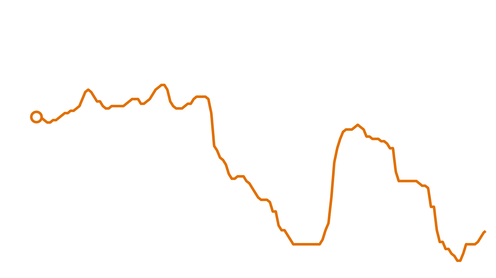

# animated-graph-generator

Visit [Github pages](https://martodox.github.io/animated-graph-generator/#/) for detailed documentation

[Mac ARM install tips](https://github.com/SeanSobey/ChartjsNodeCanvas/issues/107#issuecomment-1185438310)